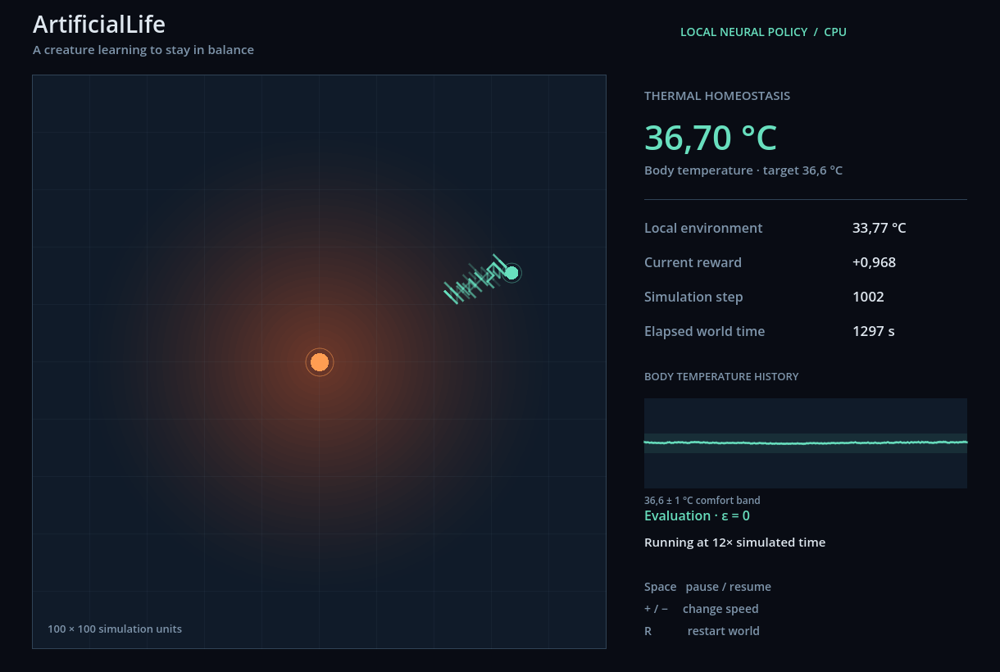
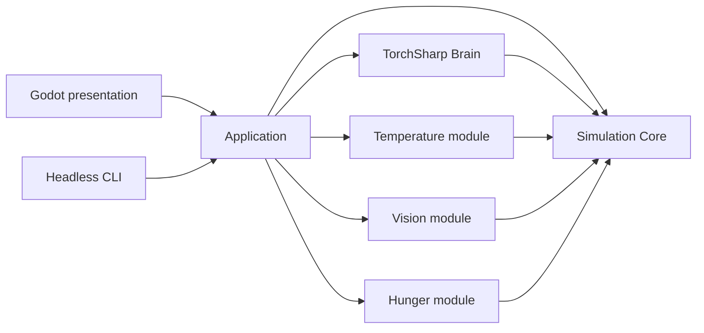

# ArtificialLife

A small simulated creature learns to regulate its own body temperature in a changing 2D thermal environment. Its brain is a local TorchSharp neural network trained through reinforcement learning, entirely in C#.

The experiment asks one question: **can a fixed neural architecture learn homeostasis while its observations and available actions remain extensible?**



*Actual Godot capture of the trained policy. The creature is the green circle; the orange marker is the heat source.*

## What works today

- One seedable, bounded 100 × 100 world, one circular agent and one central heat source.
- A smoothly changing temperature field and body temperature with thermal inertia.
- Component-based world objects and egocentric direct-geometry vision behind a replaceable backend.
- Bounded hunger, four edible apple entities and automatic feeding at contact, using the shared drive reward.
- Variable observation tokens, trainable type embeddings and a Deep Sets state encoder.
- Shared scalar Q scoring for variable sets of legal action candidates.
- CPU Double DQN with replay, Adam, Huber loss, gradient clipping and a target network.
- Fast headless training, frozen-policy evaluation and verified checkpoint loading.
- A Godot .NET view with a heat field, movement trail, thermal history and debug HUD.

No LLM, external AI service, sprite assets or additional game mechanics are involved.

## Quick start: Windows x64

Clone the repository into a writable directory. Windows PowerShell 5.1 or PowerShell 7 and internet access are sufficient; administrator privileges are not needed.

```powershell
./tools/bootstrap.ps1
./tools/build.ps1
./tools/test.ps1
./tools/train.ps1
./tools/run-godot.ps1
```

If Windows blocks an unsigned script, use a process-only policy override; organization-enforced policies may still apply:

```powershell
powershell -NoProfile -ExecutionPolicy Bypass -File ./tools/bootstrap.ps1
```

Bootstrap detects the architecture, reuses the **exact pinned SDK** and compatible pinned Godot .NET executable if available, or downloads official ZIP distributions into `.tools/`. SHA512 hashes are checked before extraction. NuGet packages also live in `.tools/nuget`. Nothing is installed globally. Bootstrap restores locked dependencies and executes three neural shape tests to exercise the native Torch backend.

`global.json` also directs .NET 10 hosts to search `.tools/dotnet` before their global installation. After bootstrap, a normal `dotnet` command or a current Visual Studio SDK resolver can therefore find the local pinned SDK even when only .NET 10 is installed globally. Older hosts do not understand this search-path option: use the repository scripts, which explicitly launch the local SDK, or start your IDE from a shell configured with that SDK. If Visual Studio already displayed an SDK-resolution error, reload the solution after bootstrap. See [Microsoft's SDK search-path documentation](https://learn.microsoft.com/en-us/dotnet/core/tools/global-json#paths).

Windows ARM64 and x86 are explicitly rejected: the upstream LibTorch CPU dependency selected for this MVP has Windows x64 binaries only. The script does not pretend that installing an ARM64 Godot editor would solve that limitation.

Downloads are several hundred MB, mostly the SDK and LibTorch. They are ignored by Git. Bootstrap is repeatable and accepts `-ForceLocal` to bypass global tool reuse, or `-Headless` to skip downloading the Godot editor. Building the Godot C# project itself requires only its NuGet SDK.

### Pinned environment

| Tool / dependency | Version |
| --- | --- |
| .NET SDK / target framework | 8.0.425 / net8.0 |
| Godot .NET / Godot.NET.Sdk | 4.7.2 |
| TorchSharp / LibTorch CPU | 0.107.0 / 2.10.0 |
| xUnit v3 / Visual Studio runner | 4.0.1 / 4.0.0 |
| Microsoft.NET.Test.Sdk | 18.10.1 |

Pins are in `global.json`, `tools/versions.json`, the Godot project and `Directory.Packages.props`; resolved transitive dependencies are committed in `packages.lock.json`. .NET 8 was selected as the conservative common target for Godot and TorchSharp. It approaches its support deadline in November 2026; upgrading the framework is an early maintenance task.

Official references: [.NET releases](https://builds.dotnet.microsoft.com/dotnet/release-metadata/8.0/releases.json), [Godot 4.7.2](https://github.com/godotengine/godot/releases/tag/4.7.2-stable), [TorchSharp](https://www.nuget.org/packages/TorchSharp/0.107.0), [xUnit v3](https://www.nuget.org/packages/xunit.v3/4.0.1).

### Useful commands

```powershell
./tools/build.ps1 -Headless             # CLI and tests without Godot project
./tools/test.ps1 -Fast                  # omit the short learning experiment
./tools/train.ps1 -Steps 100000
./tools/train.ps1 -Config configs/default.json -Checkpoint artifacts/checkpoints/thermal
./tools/evaluate.ps1                    # reload weights; exploration is disabled
./tools/run-godot.ps1 -Smoke             # load checkpoint, advance 1,000 steps, exit
```

The CLI also works directly with a compatible SDK:

```powershell
dotnet run --project src/ArtificialLife.Cli -c Release -- train --config configs/default.json
dotnet run --project src/ArtificialLife.Cli -c Release -- evaluate --checkpoint artifacts/checkpoints/thermal
```

The project includes conditional Linux x64 LibTorch support. Linux is not part of the verified bootstrap workflow: install SDK 8.0.425, run `dotnet restore` to resolve Linux packages, then build/run the CLI. Windows lock files cannot be used with `--locked-mode` for that first platform change. CI verifies Windows x64.

## Training and visualization

Training advances fixed simulation timesteps as fast as the CPU allows; it never waits for wall-clock time or opens Godot. Every 5,000 steps it reports exploration, rolling reward, loss, body temperature, absolute error, comfort percentage and replay size.

`train.ps1` saves these files under `artifacts/checkpoints/thermal/`:

- `weights.bin`: TorchSharp network weights.
- `manifest.json`: full configuration, ordered observation/action registries, training step count and weight SHA256.
- `evaluation.json`: random, untrained and trained results, including per-seed metrics.

`evaluate.ps1` writes `reevaluation.json` without overwriting the original training report. Checkpoints are for inference; optimizer state and replay are not saved for exact training resumption.

Godot loads the same checkpoint and consumes neutral snapshots. It advances simulation time at 12× by default. **Space** pauses, **+ / −** changes speed and **R** restarts the world. The view runs continuously beyond the trainer's episode length. If launched from the editor without a checkpoint, it displays the training command.

## Watching learning live

Start a fresh network and watch real simulation, replay and optimizer updates in Godot:

```powershell
./tools/run-godot.ps1 -Train
./tools/run-godot.ps1 -Train -TrainingSpeed Max
./tools/run-godot.ps1 -Train -Config configs/default.json -VisualConfig configs/live-training.json
./tools/run-godot.ps1 -Train -Smoke       # optimize 1,000 steps, save, exit
```

Live Training starts a single continuous life with newly initialized weights. Position, body temperature, world time, fire phase, optimizer, replay and epsilon progression continue across the configured `EpisodeSteps` boundaries; those boundaries produce no terminal transitions or resets. The original `./tools/run-godot.ps1` still displays a saved policy. Headless `train.ps1` remains episodic and `evaluate.ps1` retains its existing behavior.

| Key | Live Training action |
| --- | --- |
| Space | Pause / resume simulation and training |
| + / − (including numpad) | Switch between 1×, 10×, 100× and Max |
| E | Freeze learning and observe ε = 0 in a separate world; press again to resume |
| S | Save the current policy using the existing checkpoint format |
| Ctrl + Shift + R | Start a new life: fresh weights, optimizer, replay, body, world, counters and histories |

Default rates are 60, 600 and 6,000 requested training steps/s. Max requests up to 256 steps per frame; every preset also has an 8 ms cooperative work budget. Actual throughput depends on the PC and is displayed in the HUD. Work returns to Godot between complete training steps; the physics timestep is unchanged. The displayed world and short trail show actual positions, while the two small graphs show body temperature against its target and absolute body error. Metrics use the most recent 1,000 steps. Trails and graphs remain bounded, evicting old samples without clearing at former episode boundaries.

Settings live in `configs/live-training.json`, separately from DQN/physics configuration. Live learning continues until paused or closed; `learning.trainingSteps` remains the budget for the headless command. The HUD shows Life, Age (physical steps in the training life) and TrainingStep. Ctrl + Shift + R increments the life number and resets age and training counters using the configured deterministic seed. The frozen evaluation world neither appends replay nor consumes the training RNG; resuming restores the suspended training world exactly. Histories clear on evaluation mode switches to avoid joining separate worlds.

**S** saves to `artifacts/checkpoints/live-thermal` by default, leaving the original thermal checkpoint intact. Use `-Checkpoint PATH` to choose a different destination. `-Train -Smoke` also saves there before exiting. Load a live policy through the existing pipeline:

```powershell
./tools/evaluate.ps1 -Checkpoint artifacts/checkpoints/live-thermal
./tools/run-godot.ps1 -Checkpoint artifacts/checkpoints/live-thermal
```

Saves record the actual completed step count and remain inference checkpoints; they do not resume optimizer/replay state. Full reset intentionally restarts the configured deterministic seed. Application owns the single synchronous training engine; Godot only requests bounded work and draws copied read-only snapshots. See [live-training notes](docs/live-training.md) for validation and limitations.

## Measured experiment

The default 100,000-step run is compared with uniform random legal actions and an initialized neural policy. Evaluation uses ε = 0 for both neural policies, five independent initial-state seeds and four 400-step episodes per seed. All 8,000 evaluation steps count, including initial recovery; there is no discarded warm-up.

The measured results and environment are recorded in [the experiment report](docs/experiment.md). A normal full test run also includes a separate 30,000-step learning regression test using different evaluation seeds.

| Policy | Mean absolute error | Comfort time | Mean reward |
| --- | ---: | ---: | ---: |
| Random legal actions | 9.089 °C | 5.39% | -0.5525 |
| Untrained greedy network | 14.747 °C | 0.48% | -0.9369 |
| Trained greedy network | **0.327 °C** | **96.54%** | **+0.9149** |

The recorded training loop took 44.54 seconds on the development PC; evaluation and build time are additional.

## Architecture

Arrows below denote project references:



`Core`, `Brain`, `Temperature`, `Vision`, `Hunger` and `Application` contain no Godot references. Simulation coordinates are ordinary numbers. The Godot adapter alone uses `Node2D`, rendering APIs and engine vectors. Another frontend could consume `WorldViewModel` without changing physics or learning code.

```text
src/
  ArtificialLife.Core/                 world, movement, contracts, registries, reward
  ArtificialLife.Brain/                neural encoder, candidate Q scorer, Double DQN
  ArtificialLife.Modules.Temperature/  field, body dynamics, senses and drive
  ArtificialLife.Modules.Vision/       appearance, replaceable backend, egocentric sensory tokens
  ArtificialLife.Modules.Hunger/       hunger dynamics, nutrition/contact feeding, sense and drive
  ArtificialLife.Application/          composition, trainer, evaluator, checkpoints, snapshots
  ArtificialLife.Cli/                  train/evaluate commands
  ArtificialLife.Godot/                scene and rendering/input adapter
tests/ArtificialLife.Tests/            core, temperature, neural and learning tests
configs/default.json                  typed simulation and learning options
tools/                                repository-local development workflow
docs/                                 architecture and experiment documentation
.github/workflows/ci.yml               pinned Windows build and test workflow
```

One test project keeps this small repository easy to navigate. Test files separate the concerns without multiplying project boilerplate.

## Extensible senses, actions and drives

Each observation has a registered type slot and up to four normalized numeric features. A shared MLP encodes every token; masked mean pooling produces a fixed 32-number state representation. Both observation and action embedding tables have 256 reserved slots.

Actions are candidates containing a type and parameters. The same neural scorer computes `Q(state, candidate) → scalar` for each legal candidate. The nine movement choices share one movement type with different direction parameters. Future capabilities can use unused slots without adding output neurons.

Modules report scaled homeostatic drives. The core computes their weighted error and clamps the combined reward. Modules cannot hand out arbitrary reward values. The temperature module provides raw local thermal samples and the body-temperature drive; it supplies no direction to an ideal position.

Adding a module requires registration in the composition root and training with its new signals. Architectural capacity does **not** imply that a saved policy already understands a new sense or action. Checkpoints reject incompatible registry mappings. See [extensibility](docs/extensibility.md), [neural architecture](docs/neural-architecture.md) and [thermoregulation](docs/thermoregulation.md).

## Tests and CI

Tests cover legal movement, world bounds, seeded trajectories, thermal equations and changing fields, registries, normalized sensory tokens, reward bounds, permutation invariance, variable observation/action counts, new type slots, managed replay and checkpoint round-trips/corruption. Nine live-session tests additionally cover incremental equivalence, complete reset, counters, bounded snapshots, rolling metrics, saving and frozen evaluation. The learning test requires substantial improvement on separate seeds rather than a decrease in loss.

GitHub Actions restores locked packages, builds every C# project including the Godot adapter, and runs tests. Actions are pinned by commit. The workflow does not download or launch the editor; the Godot runtime smoke command is available locally.

## Limitations and future work

This is a controlled numerical experiment, not a biologically realistic organism. Learning has been validated on this small family of thermal worlds; arbitrary new physics or modules need new evaluation. Observations are fully available local samples, not noisy sensors. There is one CPU agent, fixed feature widths and finite embedding capacities. There is no model migration or exact optimizer/replay resume. The full workflow was also run from a clean source copy with no local SDK, Godot, package cache or build outputs: bootstrap downloaded and verified both tools, all 26 tests passed, retraining reproduced the evaluation metrics and Godot loaded the checkpoint. This was on the development PC, not a pristine Windows VM.

The following are **future milestones, not implemented**:

- New runtime action types, runtime plugin loading and continual learning.
- Multiple agents and a persistent long-running world.
- LLM director and LLM-generated modules.
- Remote server execution, a web frontend and WebSocket streaming.
- Sharing worlds with other people.

Hunger and apples now use the same module contracts. The next experiment is to measure whether the fixed encoder/scorer learns to balance both needs. Apples have no respawn during a continuous life; a full episode reset restores the initial objects. Existing thermal-only benchmark numbers above describe the earlier experiment. Policies saved before Hunger require retraining for the added observation keys.
