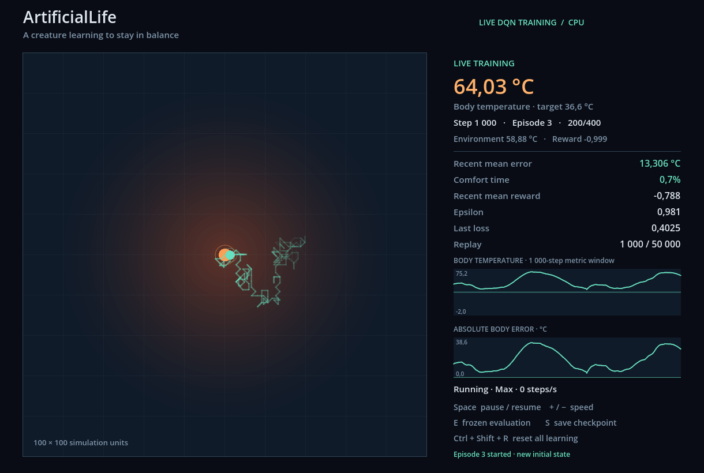
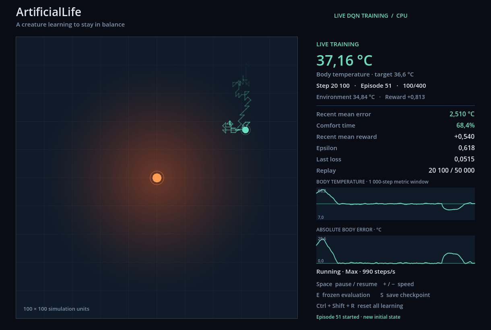

# Live Training

Run `./tools/run-godot.ps1 -Train` to initialize a new network and observe actual learning. The default speed is 10×. `-TrainingSpeed Max` requests the fastest bounded batches; `-Config` selects the experiment and `-VisualConfig` selects presentation settings. The original command without `-Train` still loads a frozen checkpoint.

## Changed files

- Application: new `TrainingEngine.cs`, `TrainingVisualizationSession.cs`, `TrainingVisualizationOptions.cs`, `RollingMetricAccumulator.cs`; updated `Trainer.cs`, `WorldViewModel.cs`, `Evaluation.cs`, `Checkpoint.cs`.
- Brain/CLI: updated `DqnBrain.cs` and `Program.cs` for RNG-free greedy selection, optimizer counters and actual saved training-step metadata.
- Godot: updated `Main.cs`; added `Main.Training.cs` for mode selection, bounded batch scheduling, HUD, graphs, controls and smoke diagnostics.
- Workflow: updated `tools/run-godot.ps1`; added `configs/live-training.json` and `tests/ArtificialLife.Tests/TrainingVisualizationTests.cs`.
- Documentation: updated `README.md` and `docs/architecture.md`; added this report and `docs/images/live-training-start.png`, `docs/images/live-training-learning.png` from actual rendered viewports.

## Controls and rates

| Input | Action |
| --- | --- |
| Space | Pause/resume all advancing work |
| + / −, including numpad | 1× → 10× → 100× → Max, or reverse |
| E | Suspend training, run the current greedy policy in a separate world, then resume |
| S | Save current inference weights and actual completed training step count |
| Ctrl + Shift + R | Dispose learned weights/optimizer and initialize a fresh seeded brain, replay and world |

Visible hints and brief save/reset/episode notices accompany these controls. Physical key codes allow the letter shortcuts to work with another keyboard layout. Reset deliberately uses a modified key combination; it restarts the configured seed, so initial weights are reproducible.

`configs/live-training.json` defaults to two training steps per visual tick and 30 visual ticks/s. The resulting requested rates are 60, 600 and 6,000 steps/s. Work is limited to 256 steps per frame and an 8 ms cooperative budget for every speed. Max keeps requesting bounded work without a rate limiter. The HUD reports achieved throughput; requested rates do not change simulation `TimeStep`.

The rolling metrics retain 1,000 physical transitions. The trail retains at most 180 actual training positions, and resets only at episode/mode boundaries. The two primitive-drawn graphs retain at most 240 samples, normally every second training step, with terminal samples always included. The body graph shows the target and comfort band; the other graph shows absolute error.

## Shared learning and ownership

`TrainingEngine.AdvanceOne()` implements the original epsilon selection → physical step → replay insertion → DQN update → deterministic episode reset order. Both `Trainer.Run()` and `TrainingVisualizationSession` call it. A terminal transition is stored before reset, and the returned sample retains its final physical state even when the displayed world has already begun the next episode.

`TrainingVisualizationSession` owns the brain, simulation, engine, rolling metrics and histories. It returns copied read-only collections of immutable primitive records. Godot requests batches and handles presentation/input; it has no tensor, replay or optimizer access. The implementation has one synchronous owner on the Godot thread. There is no background worker or concurrent model access. Node shutdown disposes the session and native brain.

Frozen evaluation uses a separate continuous simulation with epsilon zero. Greedy action selection does not consume the training RNG. Training counters, replay, optimizer, physical state and random progression are suspended; returning to training resumes them. Graphs/trails clear on mode switches to avoid joining different worlds. Training counters remain visible during evaluation, while displayed world/reward/rolling metrics belong to the evaluation world.

Live training continues until paused or closed. `Learning.TrainingSteps` remains the headless command's planned budget. **S** saves to `artifacts/checkpoints/live-thermal` unless `-Checkpoint` selects another directory. Checkpoint format remains version 1; live saves record completed steps in existing metadata. These are inference checkpoints, with no optimizer/replay resumption:

```powershell
./tools/evaluate.ps1 -Checkpoint artifacts/checkpoints/live-thermal
./tools/run-godot.ps1 -Checkpoint artifacts/checkpoints/live-thermal
```

## Verification

The full test suite passes 35 tests, including nine new Application tests covering batch equivalence with identical saved weights, live/headless equivalence, terminal/counter/epsilon progression, complete reset, checkpoint compatibility, frozen evaluation preserving training RNG, bounded immutable snapshots, rolling metrics and cooperative budget/disposal behavior.

```powershell
./tools/test.ps1
./tools/run-godot.ps1 -Smoke
./tools/run-godot.ps1 -Train -Smoke -Checkpoint artifacts/checkpoints/live-smoke
```

The training smoke advances 1,000 genuine steps, reaches the default first optimizer update, validates finite state/loss, saves the checkpoint and exits. It rejects a step count below the configured warm-up. `-SmokeSteps` can select a longer run.

Both Godot smoke paths passed: the original frozen mode advanced 1,000 steps with body temperature 36.760 °C; Live Training passed its initial 1,000-step smoke and a subsequent headless Godot run of 100,000 steps, completing 24,751 optimizer updates with replay capped at 50,000 and finite final loss 0.0043. The full live policy was saved to `artifacts/checkpoints/live-observed` using the existing format. Additional exhaustive UI testing was intentionally omitted at the user's request.

The original 100,000-step headless experiment was rerun after refactoring. Aggregate and per-seed evaluation metrics reproduce the original result exactly on this pinned environment: trained MAE 0.32747596330401163 °C, comfort 96.5375%, reward 0.9148622877758323. The training loop took 52.80 s on this run; timings vary.

Actual rendered live frames were inspected during fresh learning with OpenGL on an NVIDIA RTX 4060 Ti. At step 1,000 the trajectory was exploratory and the rolling error was 13.306 °C with 0.7% comfort. At step 20,100 the agent approached and stayed around the useful thermal region: error 2.510 °C and 68.4% comfort. Continuing the same run to step 40,024 yielded 0.456 °C and 94.7% comfort, demonstrating progression toward regulation while exploration was still active. These are recent training-window scores, not held-out evaluation. The window was closed manually before the planned full rendered run; no full-run frame-time profile is claimed.

| Early exploration, step 1,000 | Learning, step 20,100 |
| --- | --- |
|  |  |

## Performance limits

The budget is checked between complete training steps. A slow native operation, first-use initialization, screenshot or checkpoint write can exceed it; an optimizer call cannot be interrupted midway. This design favors clear ownership on the current small CPU experiment. A substantially heavier network would require profiling again and potentially one dedicated worker.

High speeds skip intermediate rendered positions, although the trail and graph samples come from real transitions. A 400-step episode can complete quickly at Max; lower speeds or frozen evaluation make individual movements easier to inspect. Recent metrics include episode recovery and exploration, so they are not the held-out greedy evaluation score. Saving synchronously may briefly pause presentation. No resume format, neural architecture, algorithm or thermal dynamics changed.
